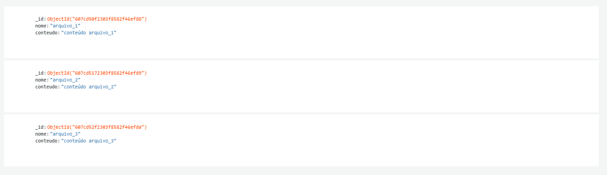

<h1>Cloud TXT</h1>

> Status do Projeto: :warning:

### Tópicos

:small_blue_diamond: [Descrição do projeto](#descrição-do-projeto)

:small_blue_diamond: [Funcionalidades](#funcionalidades)

:small_blue_diamond: [Deploy da Aplicação](#deploy-da-aplicação-dash)

:small_blue_diamond: [Pré-requisitos](#pré-requisitos)

:small_blue_diamond: [Como rodar a aplicação](#como-rodar-a-aplicação-arrow_forward)

:small_blue_diamond: [Casos de Uso](#casos-de-Uso)

:small_blue_diamond: [JSON](#json-floppy_disk)

:small_blue_diamond: [Linguagens, dependencias e libs utilizadas](#linguagens-dependencias-e-libs-utilizadas-books)

:small_blue_diamond: [Tarefas em aberto](#tarefas-em-aberto)

:small_blue_diamond: [Licença](#licença)

## Descrição do projeto

<p align="justify">
  Mini nuvem criada para armezenar arquivos de texto usando Mongo DB Atlas.
</p>

## Funcionalidades

:heavy_check_mark: Visualização dos arquivos

:heavy_check_mark: Download dos arquivos

:heavy_check_mark: Deletar os arquivos

## Layout ou Deploy da Aplicação :dash:

<br>

<h3>Link da aplicação web</h3>

> Heroku: https://cloud-txt.herokuapp.com/

<br/>

<h3>Aplicação desktop</h3>


<br>

## Pré-requisitos

:zap: [VS Code](https://code.visualstudio.com/)

:zap: [Visual Studio](https://visualstudio.microsoft.com/pt-br/)

:zap: [Node](https://nodejs.org/en/download/) (Web)

:zap: [.NET 5](https://dotnet.microsoft.com/download)

:zap: [Git](https://git-scm.com/)

## Como rodar a aplicação :arrow_forward:

No terminal, clone o projeto:

```
git clone https://github.com/rafaelmmayer/cloudTXT.git
```

<br>

<h3>Aplicação Web</h3>

```
cd .\web\client\
```

```
npm i
```

```
cd ..\server\
```

```
npm i
```

Renomeia .dev.env para .env

Preencha CONNECTION_STRING com uma conexao com um conexão com um banco Mongo

```
npm start
```

Agora o servidor estará ligado na porta 5000

<br>

<h3>Aplicação Desktop</h3>

```
cd .\cloudTXT\desktop\
```

Execute o desktopApp.sln para abrir a solução no Visual Studio

## Casos de Uso

Para qualquer pessoa que queira uma aplicação simples para armazenar e acessar de qualquer lugar seus arquivos de textos.

## JSON :floppy_disk:

### Usuários:

| nome      | conteudo           |
| --------- | ------------------ |
| arquivo_1 | conteúdo arquivo_1 |

<br>



## Linguagens, dependencias e libs utilizadas :books:

- [Node](https://nodejs.org/en/)
- [MongoDB](https://www.mongodb.com/2)
- [Bootstrap](https://getbootstrap.com/)
- [Material Design In XAML](http://materialdesigninxaml.net/)

## Tarefas em aberto

:memo: Página de registro pessoal

:memo: Página para upload de Arquivo de texto

:memo: Criação de um aplicativo que salve os arquivos no banco

## Licença

The [MIT License]() (MIT)

Copyright :copyright: 2021 - Cloud TXT
